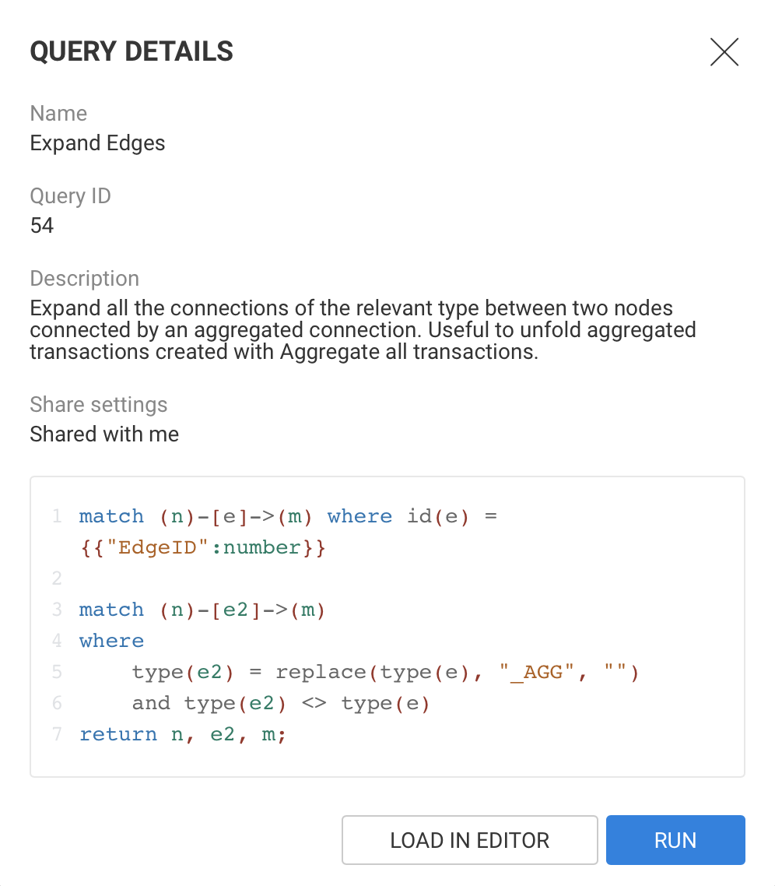
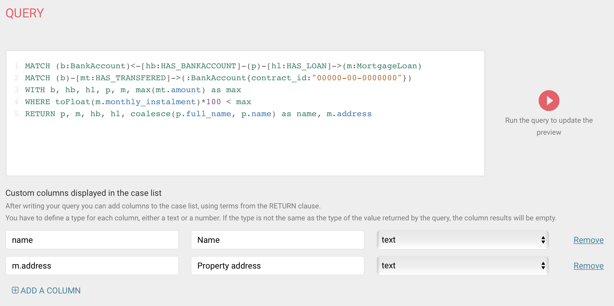
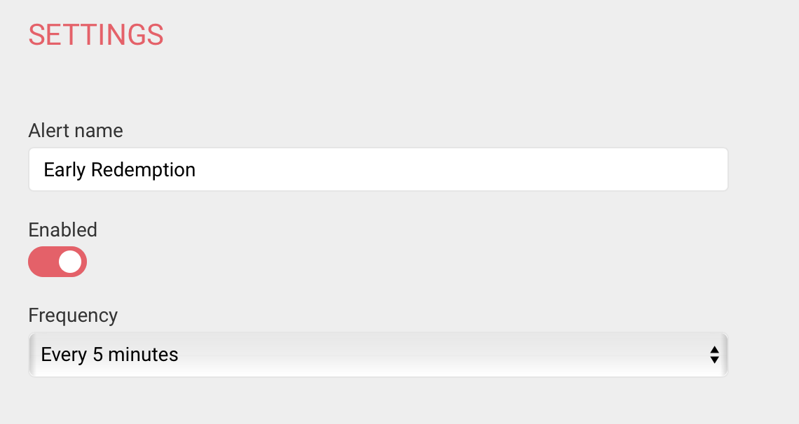
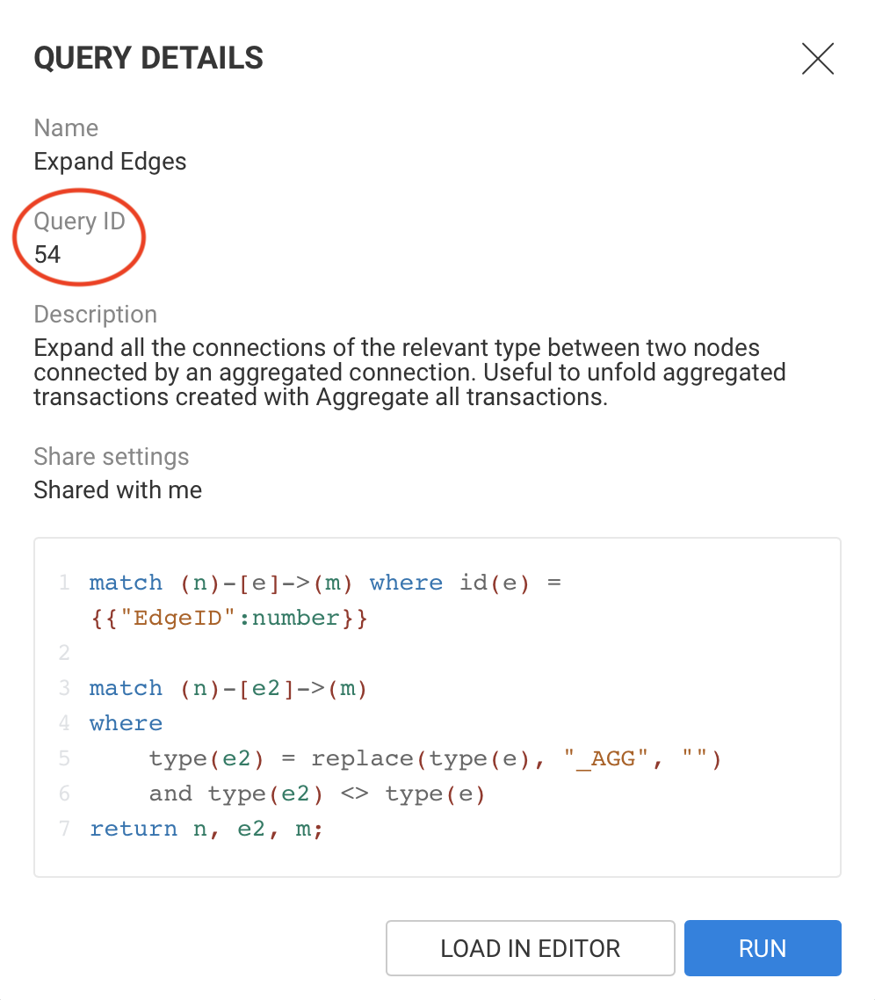

# AML Dataset implementation guide
Brief introduction here.

### Prerequisites:
- a  Neo4j 3.5.x server with read/write access
- APOC procedures are enabled in Neo4j (more information [here](https://neo4j.com/docs/labs/apoc/current/introduction/#installation))
- a  Linkurious Enterprise 2.9.x server with admin access ([getting started guide](https://doc.linkurio.us/admin-manual/latest/getting-started/))

## Topics:

1. [Importing the data in Neo4j](#1-importing-the-data-in-neo4j)

2. [Adding the datasource in Linkurious Enterprise](#2-adding-the-datasource-in-linkurious-enterprise)

3. [Setting default styles](#3-setting-default-styles)

4. [Setting default captions](#4-setting-default-captions)

5. [Setting queries](#5-setting-queries)

6. [Setting alerts](#6-setting-alerts)

7. [Setting custom actions](#7-setting-custom-actions)

8. [Setting the plugin](#8-setting-the-plugin)

## 1. Importing the data in Neo4j

1. Login to Neo4j Browser with an user having read/write access

2. On the `Browser settings` panel, enable, if it's not, the `Enable multi statement query editor` option \
\

3. Copy the whole content of the `scripts/import.cypher` file and paste it in the Neo4j query field

4. Run the query and wait

5. *(Optional)* If you want to check the import results, run `:sysinfo` as a query and compare the number of nodes/edges in your database with the following table:\
\

6. Done!

## 2. Adding the datasource in Linkurious Enterprise

1. Login to Linkurious Enterpise with an user having admin access

2. Go to `Admin` -> `Data-sources management` panel and click on `ADD A DATA SOURCE`

3. Fill these fields with the following values:
    - GRAPH SERVER
        - **Name**: AML
        - **Vendor**: Neo4j
        - **URL**: *\<url:port>* (a stable idenfier for your Neo4j server)
        - **Username**: *\<yourUsername\>* (your Neo4j read/write user)
        - **Password**: *\<yourPassword\>* (your Neo4j read/write password)

    - Other
        - **Alternative node ID**: uid
        - **Alternative edge ID**: uid

    - SEARCH INDEX SERVER
        - **Vendor**: Neo4j Search

4. Click on `SAVE CONFIGURATION`

5. Start the indexing process by pressing `START` and wait

6. Done!

## 3. Setting default styles

1. Go to `Admin` -> `Data-source settings` panel

2. Scroll to the `Default styles` field and replace the whole content with the content of the `lke-configurations/default-styles.json` file

3. Click on `Save`

4. Done!

## 4. Setting default captions

1. Go to `Admin` -> `Data-source settings` panel

2. Scroll to the `Default captions` field and replace the whole content with the content of the `lke-configurations/default-captions.json` file

3. Click on `Save`

4. Done!

## 5. Setting queries

All the *Standard Queries* and *Query Templates* are contained in the `lke-configurations/queries.cypher` file \
\
Repeat this procedure for every query in the file:

1. Open the *query editor* panel (more information [here](https://doc.linkurio.us/user-manual/latest/query-templates/#managing-queries-and-templates))

2. Copy the query from the file and paste it in the `Write a query or a template` field

3. Click on `Save`

4. Fill the `Name` and `Description` fields with the values provided in the file

5. Click on `Save` again

> Example:\
> This is how the query should look like \
> \
> \
> \
> NOTE: `Query ID` may be different in your case

6. Done!

## 6. Setting alerts

All the *Alerts* are contained in the `lke-configurations/alerts.cypher` file \
\
Repeat this procedure for every alert in the file:

1. On the *Alert dashboard*, click `CREATE NEW ALERT` (more information [here](https://doc.linkurio.us/user-manual/latest/alert-dashboard/)).

2. Copy the query from the file and paste it in the `Query` field

4. Click on `ADD A COLUMN` and fill the fields with the values provided in the file \
*NOTE: repeat this step if more columns are specified in the file* \
\

3. Click on `NEXT`

5. Fill the `Alert name` field with the value provided in the file and turn on, if it's not, the `Enable` toggle \
\

6. Click on `Save`

7. Done!

## 7. Setting custom actions

All the *Custom actions* are contained in the `lke-configurations/custom-actions.txt` file \
\
Repeat this procedure for every custom action in the file:

1. Open the *Custom action* panel (more information [here](https://doc.linkurio.us/user-manual/2.9.1/custom-actions/#managing-custom-actions))

2. Click on `NEW CUSTOM ACTION`

3. Fill the `Custom action name`, `URL template` and `Description` fields with the values provided in the file

4. Replace *\<xxx\>* with the *id* of the query indicated in the file (read [How to retrieve the ID of a query](#how-to-retrieve-the-id-of-a-query) section)

5. Click on `SAVE`

> Example:\
> This is how the custom action should look like \
> \
> \
> \
> NOTE: `queryID` value may be different in your case

7. Done!

> ## How to retrieve the ID of a query ##
> 1. Open the *QUERIES* panel (more information [here](https://doc.linkurio.us/user-manual/latest/query-templates/#managing-queries-and-templates))
> 2. Identify the desired query
> 3. Click on `More` and then on `View details...`
> 4. The `queryID` is now displayed \
> 

## 8. Setting the plugin

1. Download the `data-table` plugin available [here](https://github.com/Linkurious/lke-plugin-data-table).

2. Copy the `.lke` archive in the folder `<lke-server>/data/plugins`

3. On Linkurious Enterprise dashboard, go to `Admin` -> `Global configuration`

4. Scroll to the `Plugin settings` field

5. If there are no other plugins configured here, replace the whole content of the field with the content of the `lke-configurations/plugins.json` file and skip to step 8. \
Otherwise, go to step 6

6. Copy the whole content of the `lke-configurations/plugins.json` file **except** for the `{` at the beginning and for the `}` at the end of the file

7. On the `Plugin settings` field, add an new empty line before the last `}`, add in this line a comma (`,`) and, after the comma, paste the content copied in the step 6

8. Click on `Save`

9. Done!